# Alternatives to Emerge

## Overview

This document compares emerge with alternative approaches for coordination and synchronization. Some are genuine alternatives with different trade-offs, while others might seem similar but fundamentally differ in their approach or capabilities.

## True Alternatives

### 1. Master-Worker Pattern

**How it works**: A central master distributes work to workers and collects results.

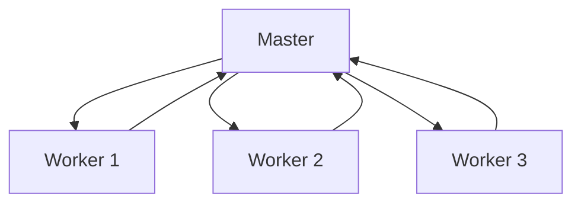

**Example Implementation**:

```go
type Master struct {
    workQueue chan Task
    results   chan Result
    workers   []*Worker
}

func (m *Master) Distribute() {
    for task := range m.tasks {
        m.workQueue <- task  // Master assigns work
    }
}
```

**When to use instead of emerge**:

- ✅ Need strict task assignment control
- ✅ Have reliable central infrastructure
- ✅ Tasks are independent (no coordination needed)
- ✅ Need simple debugging and monitoring

**Why emerge is different**:

- Emerge has no master - all agents are equal
- Emerge handles coordination, not just distribution
- Emerge survives master failure (no SPOF)
- Emerge scales without bottleneck

### 2. Consensus Algorithms (Raft/Paxos)

**How it works**: Nodes vote to agree on values through leader election and log replication.

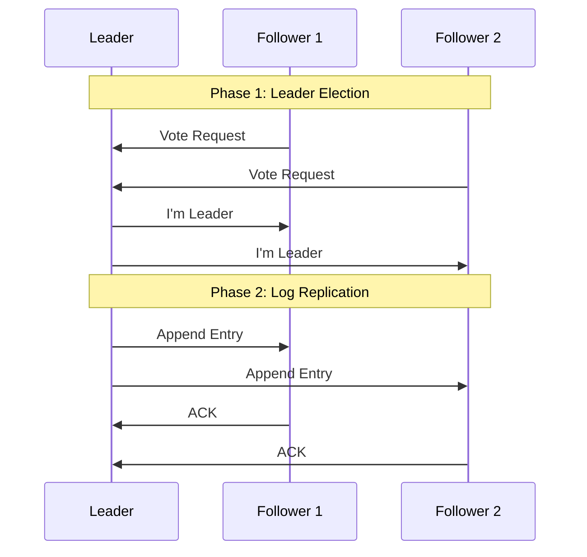

**Example Implementation**:

```go
type RaftNode struct {
    state       State  // Leader, Follower, Candidate
    currentTerm int
    votedFor    string
    log         []LogEntry
}

func (r *RaftNode) RequestVote(term int, candidateId string) bool {
    // Voting logic for discrete decisions
    if term > r.currentTerm {
        r.currentTerm = term
        r.votedFor = candidateId
        return true
    }
    return false
}
```

**When to use instead of emerge**:

- ✅ Need distributed database consistency
- ✅ Require discrete decision making
- ✅ Need strong consistency guarantees
- ✅ Must maintain ordered log of events

**Why emerge is different**:

- Emerge does continuous synchronization, not discrete consensus
- Emerge needs no leader election
- Emerge handles dynamic values, not fixed decisions
- Emerge optimizes for coordination, not consistency

### 3. Message Queues (RabbitMQ/Kafka)

**How it works**: Producers send messages to queues, consumers process them.

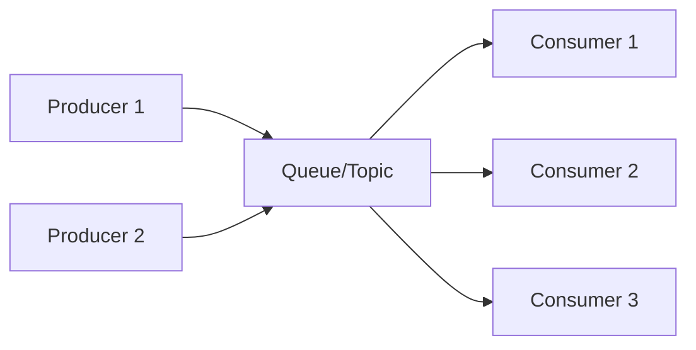

**Example Implementation**:

```go
type MessageQueue struct {
    broker   *Broker
    producer *Producer
    consumer *Consumer
}

func (mq *MessageQueue) PublishBatch(messages []Message) {
    // Broker handles batching
    mq.broker.BatchAndSend(messages)
}
```

**When to use instead of emerge**:

- ✅ Need persistent message delivery
- ✅ Want decoupled producers/consumers
- ✅ Require message replay capability
- ✅ Need guaranteed delivery semantics

**Why emerge is different**:

- Emerge coordinates timing, not message passing
- Emerge agents interact directly, no broker needed
- Emerge focuses on when to act, not what to communicate
- Emerge provides synchronization, not messaging

### 4. Distributed Locks (Redis/Zookeeper)

**How it works**: Distributed lock managers coordinate access to shared resources.

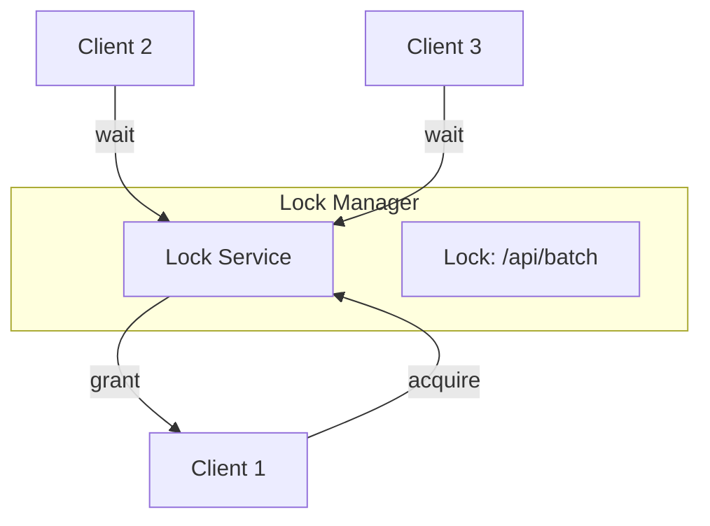

**Example Implementation**:

```go
type DistributedLock struct {
    redis *Redis
    key   string
    ttl   time.Duration
}

func (dl *DistributedLock) TryBatch() error {
    if dl.Acquire() {
        defer dl.Release()
        performBatchOperation()
    }
    return nil
}
```

**When to use instead of emerge**:

- ✅ Need exclusive access to resources
- ✅ Require strict mutual exclusion
- ✅ Have shared mutable state
- ✅ Need simple coordination primitive

**Why emerge is different**:

- Emerge needs no locks - agents coordinate naturally
- Emerge allows parallel action when synchronized
- Emerge is lock-free and wait-free
- Emerge handles timing, not exclusion

## Apparent Alternatives (But Not Really)

### 1. Cron-based Scheduling

**Why it seems similar**: Both can coordinate timing of operations.

```mermaid
gantt
    title Cron vs Emerge Timing
    dateFormat HH:mm
    axisFormat %H:%M

    section Cron
    Task A :00:00, 1m
    Task B :00:00, 1m
    Task C :00:00, 1m
    Note: All fixed at same time

    section Emerge
    Agent A converges :00:00, 5s
    Agent B converges :00:01, 4s
    Agent C converges :00:02, 3s
    All synchronized :00:05, 1m
```

**Example Comparison**:

```go
// Cron: Static, predetermined
cronJob := "0 * * * *"  // Every hour, exactly

// Emerge: Dynamic, emergent
emerge.MinimizeAPICalls()  // Synchronize when ready
```

**Why it's not an alternative**:

- ❌ Cron is static scheduling, emerge is dynamic
- ❌ Cron can't adapt to system conditions
- ❌ Cron can't handle distributed coordination
- ❌ Cron causes thundering herd, emerge prevents it

### 2. Load Balancers

**Why it seems similar**: Both can distribute work across multiple nodes.

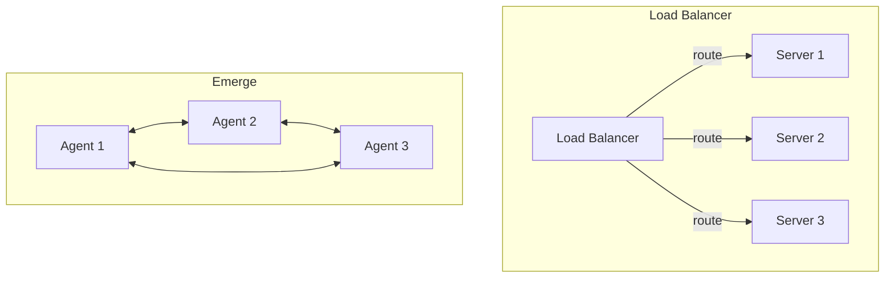

**Example Comparison**:

```go
// Load Balancer: External distribution
lb.Route(request) // Balancer decides

// Emerge: Self-organizing distribution
emerge.DistributeLoad() // Agents coordinate themselves
```

**Why it's not an alternative**:

- ❌ Load balancers route requests, emerge coordinates agents
- ❌ Load balancers are centralized, emerge is decentralized
- ❌ Load balancers don't synchronize, they distribute
- ❌ Load balancers need external configuration

### 3. Circuit Breakers

**Why it seems similar**: Both can coordinate system behavior based on conditions.

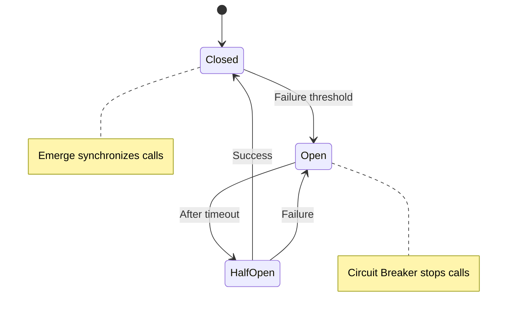

**Example Comparison**:

```go
// Circuit Breaker: Failure protection
if circuitBreaker.IsOpen() {
    return ErrCircuitOpen  // Stop all calls
}

// Emerge: Coordinated action
if emerge.IsConverged() {
    batchAPICalls()  // Optimize calls
}
```

**Why it's not an alternative**:

- ❌ Circuit breakers prevent actions, emerge coordinates them
- ❌ Circuit breakers react to failure, emerge optimizes success
- ❌ Circuit breakers are binary, emerge is continuous
- ❌ Circuit breakers protect, emerge enhances

### 4. Event Bus / Pub-Sub

**Why it seems similar**: Both involve multiple components interacting.

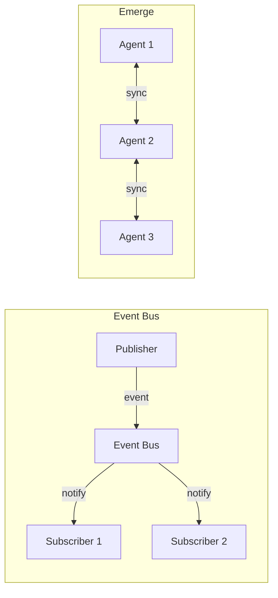

**Example Comparison**:

```go
// Event Bus: Message broadcasting
eventBus.Publish("batch.ready", data)
// Subscribers react independently

// Emerge: Phase synchronization
emerge.Synchronize()
// Agents coordinate timing
```

**Why it's not an alternative**:

- ❌ Event bus broadcasts messages, emerge synchronizes timing
- ❌ Event bus is about what happened, emerge is about when to act
- ❌ Subscribers are independent, emerge agents coordinate
- ❌ Event bus needs infrastructure, emerge is self-contained

## Hybrid Approaches

### Emerge + Message Queue

**Best of both worlds**: Use emerge for timing, queue for communication.

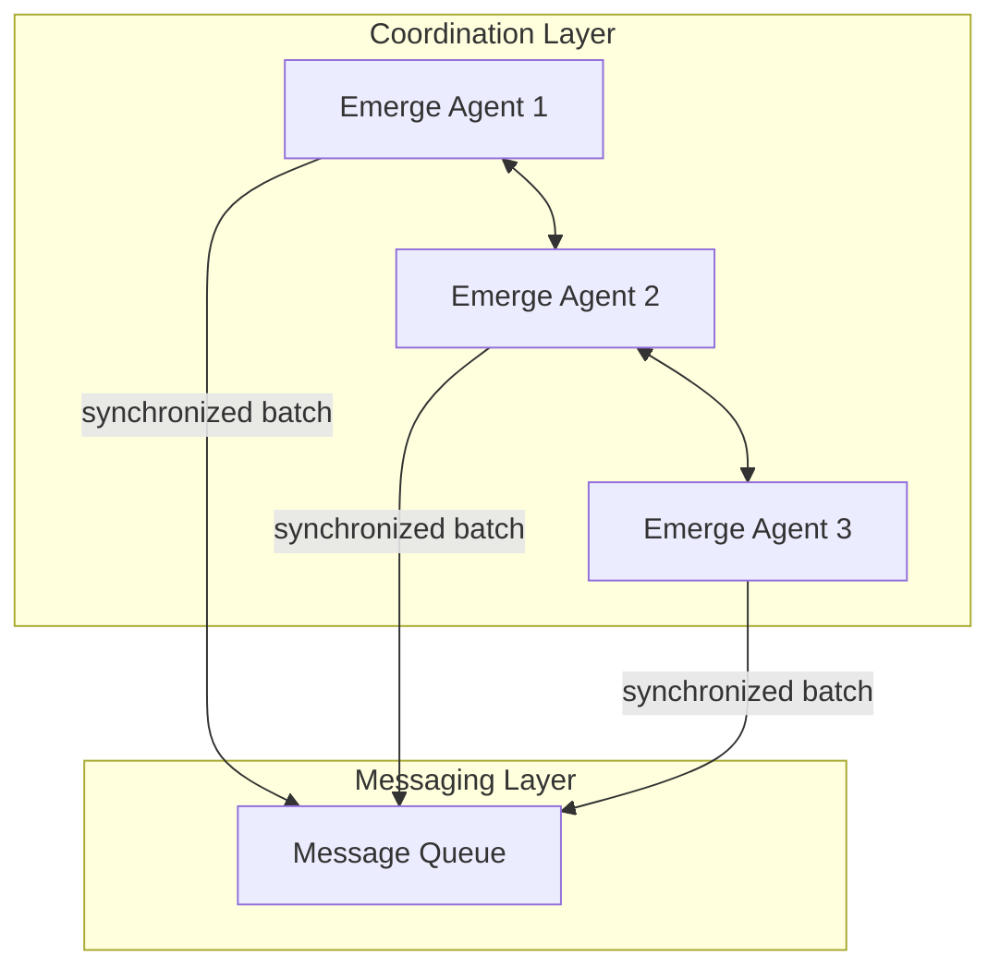

**Example**:

```go
// Emerge coordinates when
if emerge.IsConverged() {
    // Queue handles what
    messages := collectMessages()
    queue.PublishBatch(messages)
}
```

### Emerge + Consensus

**Coordinated consensus**: Use emerge for timing, consensus for decisions.

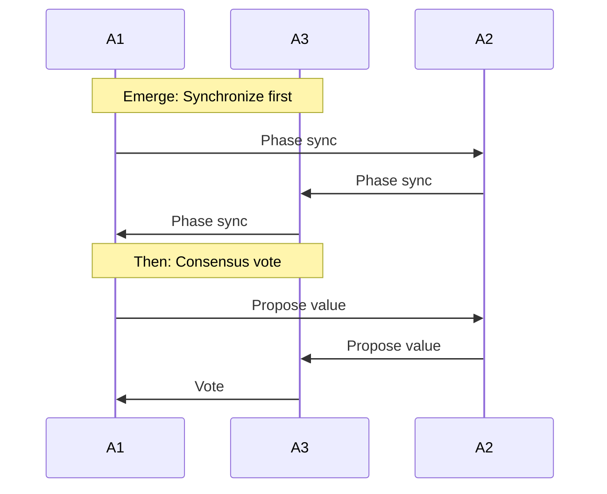

**Example**:

```go
// First synchronize with emerge
emerge.ReachConsensus()

// Then make decision with Raft
if emerge.IsConverged() {
    raft.ProposeValue(value)
}
```

## Decision Matrix

| Need                                        | Best Choice          | Why                                      |
| ------------------------------------------- | -------------------- | ---------------------------------------- |
| Coordinate timing across distributed agents | **Emerge**           | Designed for distributed synchronization |
| Distribute independent tasks                | **Master-Worker**    | Simple, effective for independent work   |
| Agree on discrete values                    | **Raft/Paxos**       | Proven consensus algorithms              |
| Pass messages between services              | **Message Queue**    | Reliable, persistent messaging           |
| Protect shared resources                    | **Distributed Lock** | Simple mutual exclusion                  |
| Schedule at fixed times                     | **Cron**             | Simple, predictable                      |
| Route HTTP requests                         | **Load Balancer**    | Purpose-built for request routing        |
| Batch operations dynamically                | **Emerge**           | Adaptive, emergent batching              |
| Prevent cascade failures                    | **Circuit Breaker**  | Fail-fast protection                     |
| Broadcast events                            | **Event Bus**        | Decoupled event propagation              |

## Common Misconceptions

### "Just use a database lock"

**Misconception**: Database locks can coordinate distributed operations.

**Reality**:

```go
// Database lock: Exclusive access
tx.Lock("batch_lock")
// Only ONE process can batch

// Emerge: Coordinated parallel access
emerge.Synchronize()
// ALL agents batch together
```

**Why emerge is better for coordination**:

- Allows parallel execution when synchronized
- No lock contention or deadlocks
- Scales without database bottleneck

### "Kubernetes can handle this"

**Misconception**: Container orchestration provides application-level coordination.

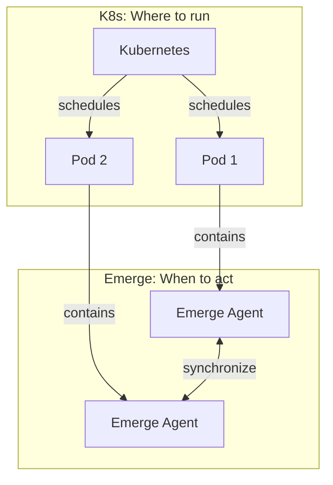

**Why they're complementary**:

- K8s handles deployment and scaling
- Emerge handles runtime coordination
- K8s is infrastructure, emerge is application logic

### "Just use webhooks"

**Misconception**: Webhooks can coordinate distributed systems.

**Reality**:

```go
// Webhooks: Notification after the fact
onEvent := func() {
    callWebhook(url)  // Tell others something happened
}

// Emerge: Coordination before action
beforeAction := func() {
    emerge.Synchronize()  // Coordinate when to act
}
```

**Why emerge is different**:

- Webhooks notify, emerge coordinates
- Webhooks are reactive, emerge is proactive
- Webhooks need endpoints, emerge is peer-to-peer

## Performance Comparison

| Approach         | Latency | Throughput | Scalability | Fault Tolerance |
| ---------------- | ------- | ---------- | ----------- | --------------- |
| Emerge           | Low     | High       | Excellent   | Excellent       |
| Master-Worker    | Medium  | Medium     | Limited     | Poor (SPOF)     |
| Raft/Paxos       | High    | Low        | Good        | Good            |
| Message Queue    | Medium  | High       | Good        | Good            |
| Distributed Lock | High    | Low        | Poor        | Medium          |
| Cron             | N/A     | N/A        | Excellent   | Good            |
| Load Balancer    | Low     | High       | Good        | Medium          |

## When NOT to Use Emerge

Be honest about emerge's limitations:

1. **Need ACID transactions** → Use database
2. **Need message persistence** → Use message queue
3. **Need discrete consensus** → Use Raft/Paxos
4. **Need simple task distribution** → Use master-worker
5. **Need HTTP routing** → Use load balancer
6. **Need fixed scheduling** → Use cron
7. **Need exclusive access** → Use locks

## See Also

- [Algorithm](algorithm.md) - How emerge works
- [Decentralization](decentralization.md) - Why emerge has no center
- [Use Cases](primitive.md) - When to use emerge
- [Architecture](architecture.md) - System design
