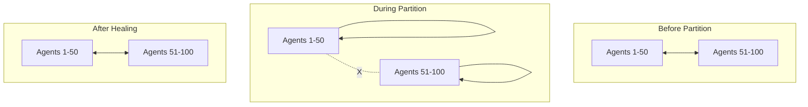

# Disruption Handling in Emerge

## Overview

Emerge is designed to maintain synchronization despite disruptions - unexpected events that perturb the system from its goal state. This resilience comes from the combination of decentralized architecture, goal-directed behavior, and adaptive strategies.

## Types of Disruptions

### 1. Agent Failures

**Individual Agent Crashes**

```go
// System with 100 agents synchronized at coherence = 0.95
// Agent 42 crashes unexpectedly
//
// Emerge's response:
// - Remaining 99 agents detect coherence drop to ~0.94
// - Neighbors of agent 42 stop receiving observations
// - System automatically adjusts to maintain synchronization
// - Coherence returns to 0.95 within seconds
```

**Mass Failures**

```go
// Up to 50% of agents can fail simultaneously
// System continues functioning with degraded but stable coherence
initialAgents := 1000
failedAgents := 450  // 45% failure

// System maintains coherence > 0.7 even with mass failure
// Gradually recovers as new agents join
```

### 2. Network Disruptions

**Network Partitions**



Each partition maintains internal synchronization. When the network heals, partitions re-synchronize.

**Packet Loss**

```go
// Emerge tolerates intermittent communication failures
// Missing observations are simply skipped
func (a *Agent) ObserveNeighbors() {
    for _, neighbor := range a.neighbors {
        state, err := neighbor.GetState()
        if err != nil {
            // Skip this neighbor, continue with others
            continue
        }
        a.processObservation(state)
    }
}
```

### 3. Performance Disruptions

**CPU Starvation**

```go
// Agent update slows from 10ms to 100ms due to CPU pressure
//
// Emerge's adaptation:
// - Slower agents naturally fall behind in phase
// - Faster agents slow their adjustment rate
// - System finds new equilibrium at lower update frequency
// - Synchronization maintained at reduced speed
```

**Memory Pressure**

```go
// System under memory pressure
//
// Emerge's response:
// - Atomic operations prevent corruption
// - No memory allocation in hot path
// - Graceful degradation if swapping occurs
// - Core synchronization logic continues
```

### 4. Behavioral Disruptions

**Oscillations**

```go
// Coherence oscillating between 0.6 and 0.9
//
// Detection and response:
if detector.OscillationDetected() {
    // Reduce coupling strength to dampen oscillations
    swarm.SetCouplingStrength(current * 0.8)

    // Or switch to more stable strategy
    swarm.SwitchStrategy(FrequencyLock)
}
```

**Drift**

```go
// Agents slowly drifting out of sync
//
// Active correction:
if swarm.Coherence() < goal.MinCoherence {
    // Increase coupling to pull agents together
    swarm.IncreaseCoupling()

    // Or pulse to re-synchronize
    swarm.SendSynchronizationPulse()
}
```

### 5. Environmental Disruptions

**Load Spikes**

```go
// Sudden 10x increase in workload
//
// Emerge's response:
client := emerge.AdaptToTraffic(scale.Large)

// Automatically tightens synchronization during spike
// Helps batch the increased load efficiently
// Relaxes when load decreases
```

**Resource Constraints**

```go
// Energy budget reduced by admin
//
// System adaptation:
func (a *Agent) AdaptToEnergyConstraint(newBudget float64) {
    a.maxEnergy = newBudget

    // Switch to energy-efficient strategy
    if newBudget < threshold {
        a.SetStrategy(EnergyAware)
    }
}
```

## Disruption Detection

### Coherence Monitoring

```go
type DisruptionDetector struct {
    baselineCoherence float64
    threshold         float64
}

func (d *DisruptionDetector) CheckForDisruption(current float64) bool {
    drop := d.baselineCoherence - current
    return drop > d.threshold
}
```

### Pattern Recognition

```go
type PatternDetector struct {
    history []float64
}

func (p *PatternDetector) DetectAnomaly() DisruptionType {
    if p.isOscillating() {
        return OscillationDisruption
    }
    if p.isFalling() {
        return FailureDisruption
    }
    if p.isDrifting() {
        return DriftDisruption
    }
    return NoDisruption
}
```

### Neighbor Monitoring

```go
func (a *Agent) DetectNeighborFailures() []AgentID {
    failed := []AgentID{}
    for id, lastSeen := range a.neighborLastSeen {
        if time.Since(lastSeen) > failureTimeout {
            failed = append(failed, id)
        }
    }
    return failed
}
```

## Recovery Mechanisms

### 1. Automatic Re-convergence

When disruption causes de-synchronization:

```go
// Automatic recovery cycle
func (s *Swarm) RecoveryLoop() {
    for {
        if s.Coherence() < s.goal.Target {
            s.InitiateRecovery()
        }
        time.Sleep(checkInterval)
    }
}

func (s *Swarm) InitiateRecovery() {
    // Try gentle correction first
    s.SetStrategy(PhaseNudge)

    if !s.WaitForConvergence(gentleTimeout) {
        // Escalate to aggressive correction
        s.SetStrategy(PulseCoupling)
    }
}
```

### 2. Strategy Switching

Different disruptions require different responses:

```go
func (s *Swarm) SelectRecoveryStrategy(disruption DisruptionType) Strategy {
    switch disruption {
    case OscillationDisruption:
        return FrequencyLock  // More stable
    case FailureDisruption:
        return PulseCoupling  // Quick re-sync
    case DriftDisruption:
        return PhaseNudge     // Gentle correction
    case NetworkPartition:
        return Adaptive       // Flexible response
    default:
        return s.currentStrategy
    }
}
```

### 3. Homeostatic Maintenance

System actively maintains goal state:

```go
type Homeostasis struct {
    targetCoherence float64
    tolerance       float64
}

func (h *Homeostasis) Maintain(swarm *Swarm) {
    deviation := math.Abs(swarm.Coherence() - h.targetCoherence)

    if deviation > h.tolerance {
        // Proportional response
        correction := deviation * correctionFactor
        swarm.AdjustCoupling(correction)
    }
}
```

### 4. Graceful Degradation

Accept reduced performance rather than failure:

```go
func (s *Swarm) DegradeGracefully(failureRate float64) {
    if failureRate > 0.3 {
        // Too many failures for tight sync
        s.goal = SaveEnergy  // Lower coherence target
    }

    if failureRate > 0.5 {
        // Extreme failures
        s.goal = MaintainRhythm  // Just stay roughly synchronized
    }
}
```

## Resilience Properties

### Fault Tolerance Limits

| Disruption Type   | Tolerance  | Recovery Time           | Notes             |
| ----------------- | ---------- | ----------------------- | ----------------- |
| Agent Failures    | Up to 50%  | Seconds to minutes      | Depends on scale  |
| Network Partition | Full       | Immediate per partition | Re-sync on heal   |
| Packet Loss       | Up to 30%  | Continuous adaptation   | Degrades smoothly |
| CPU Slowdown      | 10x slower | Continuous adaptation   | Lower update rate |
| Memory Pressure   | Varies     | Continuous              | May swap          |
| Clock Drift       | ±100ms     | Continuous              | NTP recommended   |

### Self-Healing Characteristics

**No Manual Intervention Required**

```go
// System automatically:
// - Detects disruptions
// - Selects appropriate response
// - Executes recovery
// - Returns to goal state
// - Maintains synchronization
```

**Learning from Disruptions**

```go
type AdaptiveRecovery struct {
    disruptionHistory []Disruption
    strategySuccess   map[Strategy]float64
}

func (r *AdaptiveRecovery) LearnFromRecovery(d Disruption, s Strategy, success bool) {
    if success {
        r.strategySuccess[s]++
    }
    // Use history to improve future responses
}
```

## Examples of Disruption Handling

### Example 1: Database Overload

```go
// Scenario: Database can't handle synchronized batch inserts
// Disruption: Batching causes database timeouts

client := emerge.MinimizeAPICalls(scale.Large)

// Initial: All 1000 agents batch together
// Problem: Database overloaded

// Emerge's adaptation:
// 1. Detect failures from timeout errors
// 2. Switch to DistributeLoad goal temporarily
// 3. Spread batches across time
// 4. Database recovers
// 5. Gradually return to batching with smaller groups
```

### Example 2: Rolling Deployment

```go
// Scenario: Updating agents during rolling deployment
// Disruption: Agents restart in waves

// During deployment:
// - 20% of agents restart at a time
// - Remaining 80% maintain synchronization
// - Restarted agents quickly rejoin
// - System never loses coordination

func HandleRollingUpdate(swarm *Swarm) {
    swarm.SetGoal(MaintainRhythm)  // Focus on stability

    // After deployment completes
    swarm.SetGoal(MinimizeAPICalls)  // Return to normal
}
```

### Example 3: Network Storm

```go
// Scenario: Broadcast storm causes network congestion
// Disruption: High packet loss and latency

// Emerge's response:
func HandleNetworkStorm(client *emerge.Client) {
    // Reduce network traffic
    client.SetUpdateInterval(1 * time.Second)  // Slower updates
    client.SetStrategy(EnergyAware)  // Minimal adjustments

    // After storm passes
    client.RestoreDefaults()
}
```

## Design Principles for Disruption Handling

### 1. Assume Failure

```go
// Every operation can fail
state, err := neighbor.GetState()
if err != nil {
    // Handle gracefully, don't crash
    continue
}
```

### 2. Fail Fast, Recover Faster

```go
// Don't wait for perfect conditions
timeout := 100 * time.Millisecond
ctx, cancel := context.WithTimeout(ctx, timeout)
defer cancel()
```

### 3. Multiple Recovery Paths

```go
// If one approach fails, try another
strategies := []Strategy{
    PhaseNudge,     // Gentle
    PulseCoupling,  // Aggressive
    FrequencyLock,  // Stable
}
```

### 4. Proportional Response

```go
// Match response intensity to disruption severity
func ResponseStrength(severity float64) float64 {
    return math.Min(severity * 2.0, maxResponse)
}
```

### 5. Continuous Adaptation

```go
// Never stop monitoring and adjusting
for {
    monitor()
    detect()
    respond()
    adapt()
}
```

## Monitoring Disruptions

### Metrics to Track

```go
type DisruptionMetrics struct {
    // Frequency
    DisruptionsPerHour int

    // Severity
    MaxCoherenceDrop float64

    // Recovery
    MeanTimeToRecover time.Duration

    // Impact
    SynchronizationLoss time.Duration

    // Types
    DisruptionTypes map[DisruptionType]int
}
```

### Alerting on Disruptions

```go
func (m *Monitor) CheckThresholds() {
    if m.Coherence < criticalThreshold {
        alert.Send("Critical: Synchronization lost")
    }

    if m.FailureRate > 0.4 {
        alert.Send("Warning: High failure rate")
    }

    if m.RecoveryTime > maxRecovery {
        alert.Send("Error: Recovery taking too long")
    }
}
```

## Testing Disruption Handling

### Chaos Engineering

```go
func TestChaosResilience(t *testing.T) {
    swarm := createSwarm(100)

    // Inject random failures
    go func() {
        for {
            agent := swarm.RandomAgent()
            agent.Kill()
            time.Sleep(randomDuration())
            agent.Restart()
        }
    }()

    // System should maintain coherence > 0.7
    require.Eventually(t, func() bool {
        return swarm.Coherence() > 0.7
    }, 1*time.Minute, 100*time.Millisecond)
}
```

### Network Partition Testing

```go
func TestPartitionResilience(t *testing.T) {
    swarm := createSwarm(100)

    // Create partition
    partition1, partition2 := swarm.Partition(50)

    // Each partition should maintain internal sync
    assert.Greater(t, partition1.Coherence(), 0.8)
    assert.Greater(t, partition2.Coherence(), 0.8)

    // Heal partition
    swarm.HealPartition()

    // Should re-synchronize
    require.Eventually(t, func() bool {
        return swarm.Coherence() > 0.9
    }, 30*time.Second, 100*time.Millisecond)
}
```

## Summary

Emerge's disruption handling provides:

1. **Automatic detection** of various disruption types
2. **Adaptive responses** matched to disruption severity
3. **Self-healing** without manual intervention
4. **Graceful degradation** when full recovery isn't possible
5. **Continuous operation** despite ongoing disruptions

This resilience emerges from the combination of:

- Decentralized architecture (no single point of failure)
- Goal-directed behavior (active pursuit of target states)
- Multiple strategies (alternative paths to goals)
- Local interactions (failures don't cascade globally)

The result is a system that maintains coordination despite the inevitable disruptions of distributed environments.

## See Also

- [Goal-Directed](goal-directed.md) - How goals drive recovery
- [Strategies](../concepts/strategies.md) - Recovery strategy selection
- [Decentralization](decentralization.md) - Why disruptions don't cascade
- [Security](security.md) - Handling malicious disruptions

