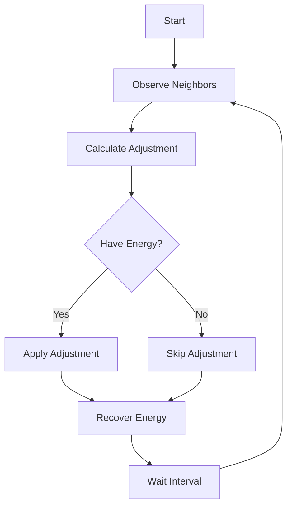

# The Emerge Synchronization Protocol

## Overview

The emerge synchronization protocol is the specific set of rules and behaviors that emerge agents follow to achieve coordinated action without central control. This protocol is unique to emerge and based on the Kuramoto model of coupled oscillators. It defines how agents observe neighbors, adjust their state, and converge toward common goals.

**Note:** This protocol is specific to the emerge primitive. Other coordination systems (like Raft, Paxos, or gossip protocols) have their own distinct protocols. The emerge protocol is designed specifically for decentralized, emergent synchronization without leaders or voting.

## Core Protocol Rules

### 1. State Maintenance

Each agent maintains three core state variables:

```go
type AgentState struct {
    Phase     float64  // Position in cycle (0 to 2π)
    Frequency float64  // Rate of phase change
    Energy    float64  // Available adjustment resources
}
```

### 2. Observation Phase

Agents periodically observe their neighbors' states:

```go
// Protocol Step 1: Observe
func (a *Agent) ObserveNeighbors() []NeighborState {
    neighbors := []NeighborState{}
    for _, n := range a.neighbors {
        neighbors = append(neighbors, n.GetState())
    }
    return neighbors
}
```

**Protocol Rules:**

- Agents observe at regular intervals (typically 10-100ms)
- Observations are read-only (no state modification)
- Agents can only see designated neighbors, not entire swarm
- Failed neighbors are ignored (no blocking)

### 3. Calculation Phase

Based on observations, agents calculate required adjustments:

```go
// Protocol Step 2: Calculate
func (a *Agent) CalculateAdjustment(neighbors []NeighborState) Adjustment {
    // Kuramoto coupling calculation
    sumSin := 0.0
    sumCos := 0.0

    for _, n := range neighbors {
        phaseDiff := n.Phase - a.Phase
        sumSin += math.Sin(phaseDiff)
        sumCos += math.Cos(phaseDiff)
    }

    // Calculate phase adjustment
    phaseAdjust := (a.couplingStrength / len(neighbors)) * sumSin

    return Adjustment{
        Phase: phaseAdjust,
        Energy: a.calculateEnergyCost(phaseAdjust),
    }
}
```

**Protocol Rules:**

- Adjustments based on Kuramoto model mathematics
- Coupling strength determines influence magnitude
- Energy cost calculated for each adjustment
- Strategy determines specific calculation approach

### 4. Adjustment Phase

Agents apply calculated adjustments to their state:

```go
// Protocol Step 3: Adjust
func (a *Agent) ApplyAdjustment(adj Adjustment) error {
    // Check energy constraint
    if adj.Energy > a.Energy {
        return ErrInsufficientEnergy
    }

    // Apply phase adjustment
    a.Phase = math.Mod(a.Phase + adj.Phase, 2*math.Pi)

    // Deduct energy cost
    a.Energy -= adj.Energy

    return nil
}
```

**Protocol Rules:**

- Adjustments are atomic (no partial updates)
- Energy constraints must be respected
- Phase wraps around at 2π (circular)
- Failed adjustments don't corrupt state

### 5. Recovery Phase

Agents recover energy between adjustments:

```go
// Protocol Step 4: Recover
func (a *Agent) RecoverEnergy(deltaTime float64) {
    recoveryAmount := a.recoveryRate * deltaTime
    a.Energy = math.Min(a.Energy + recoveryAmount, a.maxEnergy)
}
```

**Protocol Rules:**

- Energy recovers at fixed rate
- Recovery happens continuously
- Maximum energy is bounded
- Recovery independent of other agents

## Protocol Sequence

The complete protocol executes in a continuous loop:



## Strategy-Specific Protocol Variations

Different strategies modify the protocol while maintaining core rules:

### PhaseNudge Protocol

- Small, continuous adjustments
- Energy cost proportional to adjustment size
- No frequency modifications

### FrequencyLock Protocol

- Two-phase: frequency alignment, then phase sync
- Higher energy cost for frequency changes
- Stable once frequencies match

### PulseCoupling Protocol

- Discrete, strong adjustments at specific phase points
- High energy cost per pulse
- Rapid convergence but oscillation risk

### EnergyAware Protocol

- Prioritizes energy conservation
- Smaller adjustments when energy low
- May sacrifice convergence speed

### Adaptive Protocol

- Switches between strategies based on conditions
- Monitors convergence progress
- Adjusts parameters dynamically

## Protocol Guarantees

### What the Protocol Ensures

✅ **Eventual Convergence** - Given sufficient time and stable conditions  
✅ **No Deadlocks** - Agents never block waiting for others  
✅ **Graceful Degradation** - Continues with agent failures  
✅ **Bounded Resource Use** - Energy constraints prevent runaway  
✅ **State Consistency** - Atomic updates prevent corruption

### What the Protocol Does NOT Guarantee

❌ **Instant Synchronization** - Takes time to converge  
❌ **Perfect Synchronization** - May have small phase differences  
❌ **Fixed Convergence Time** - Varies with conditions  
❌ **Byzantine Tolerance** - Assumes cooperative agents  
❌ **Message Delivery** - No acknowledgments or retries

## Protocol Parameters

Key parameters that affect protocol behavior:

```go
type ProtocolParams struct {
    // Timing
    UpdateInterval   time.Duration  // How often to execute protocol

    // Coupling
    CouplingStrength float64        // Influence magnitude (K)

    // Energy
    MaxEnergy        float64        // Maximum energy capacity
    RecoveryRate     float64        // Energy per second

    // Topology
    MaxNeighbors     int           // Neighbor limit

    // Convergence
    TargetCoherence  float64       // Goal coherence level
}
```

## Protocol Implementation

### Atomic Operations

The protocol uses lock-free atomic operations for thread safety:

```go
// Atomic state updates
func (a *Agent) UpdatePhase(newPhase float64) {
    atomic.StoreUint64(
        (*uint64)(unsafe.Pointer(&a.phase)),
        math.Float64bits(newPhase),
    )
}

func (a *Agent) GetPhase() float64 {
    bits := atomic.LoadUint64((*uint64)(unsafe.Pointer(&a.phase)))
    return math.Float64frombits(bits)
}
```

### Parallel Execution

Multiple agents execute the protocol concurrently:

```go
// Parallel protocol execution
func (s *Swarm) RunProtocol(ctx context.Context) {
    for i := 0; i < runtime.NumCPU(); i++ {
        go s.workerLoop(ctx)
    }
}

func (s *Swarm) workerLoop(ctx context.Context) {
    ticker := time.NewTicker(s.updateInterval)
    defer ticker.Stop()

    for {
        select {
        case <-ctx.Done():
            return
        case <-ticker.C:
            // Get next agent to update
            agent := s.getNextAgent()
            if agent != nil {
                agent.ExecuteProtocol()
            }
        }
    }
}
```

## Protocol Monitoring

Track protocol execution and health:

```go
type ProtocolMetrics struct {
    UpdatesPerSecond   float64
    AverageAdjustment  float64
    EnergyUtilization  float64
    ConvergenceRate    float64
    ProtocolErrors     int64
}
```

## Protocol Debugging

Common protocol issues and diagnosis:

### Slow Convergence

- Check coupling strength (too weak?)
- Verify energy recovery rate
- Examine network topology
- Review update frequency

### Oscillations

- Coupling strength too high
- Energy depletion cycles
- Strategy mismatch with goal
- Phase wraparound issues

### No Convergence

- Disconnected topology
- Insufficient coupling
- Energy starvation
- Conflicting natural frequencies

## Protocol Evolution

The protocol can be extended while maintaining compatibility:

### Current Protocol (v1)

- Basic Kuramoto coupling
- Simple energy model
- Local observations only

### Future Extensions (v2+)

- Multi-level observations
- Adaptive coupling strength
- Predictive adjustments
- Byzantine fault tolerance

## Summary

The emerge synchronization protocol is a simple set of rules that enables complex coordination:

1. **Observe** - See neighbor states
2. **Calculate** - Determine adjustments
3. **Adjust** - Modify own state
4. **Recover** - Regain energy
5. **Repeat** - Continue until converged

By following these rules, independent agents achieve synchronized behavior without central control, creating an emergent coordination system that's resilient, scalable, and adaptive.

## See Also

- [Algorithm](algorithm.md) - Mathematical foundation
- [Strategies](../concepts/strategies.md) - Protocol variations
- [Synchronization](../concepts/synchronization.md) - How synchronization emerges
- [Decentralization](decentralization.md) - Why no central control

