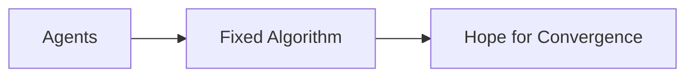
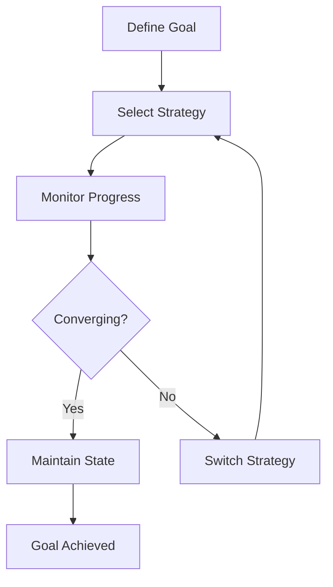

# Goal-Directed Synchronization in Emerge

## What Makes Emerge Goal-Directed?

Emerge isn't just about synchronization - it's about **pursuing specific coordination goals** despite disruptions, failures, and changing conditions. This goal-directedness, inspired by Michael Levin's research on biological systems, is what distinguishes emerge from simple synchronization algorithms.

## The Goal-Directed Architecture

### Traditional Synchronization



### Emerge's Goal-Directed Approach



## How Goals Drive Behavior

### 1. Goals as Invariants

In emerge, goals aren't suggestions - they're **invariants** that the system actively maintains:

```go
// The goal is not "try to batch" but "achieve batching"
client := emerge.MinimizeAPICalls(scale.Medium)

// The system will pursue this goal through multiple strategies
// until it achieves and maintains the target coherence
```

### 2. Multiple Pathways to Goals

Just like biological systems that can achieve the same morphological outcome through different developmental paths, emerge can reach the same synchronization goal through different strategies:

```go
// Goal: MinimizeAPICalls (coherence > 0.9)
//
// Path 1: PhaseNudge strategy works in stable conditions
// Path 2: System switches to PulseCoupling if convergence stalls
// Path 3: Falls back to FrequencyLock if oscillations occur
//
// All paths lead to the same goal state
```

### 3. Adaptive Strategy Selection

The system monitors progress toward goals and adapts its approach:

```go
type GoalMonitor struct {
    targetCoherence float64
    currentStrategy Strategy
    convergenceRate float64
}

func (m *GoalMonitor) CheckProgress() {
    if m.convergenceRate < threshold {
        // Not making progress toward goal
        m.SwitchStrategy()
    }
}
```

## The Eight Goals

Each goal represents a different coordination objective:

### 1. MinimizeAPICalls

**Goal**: Achieve high coherence (>0.9) for synchronized batching

```go
// System pursues tight synchronization
// Switches strategies if agents drift apart
client := emerge.MinimizeAPICalls(scale.Large)
```

### 2. DistributeLoad

**Goal**: Maintain anti-phase synchronization for load spreading

```go
// System actively maintains phase separation
// Corrects if agents start clustering
client := emerge.DistributeLoad(scale.Medium)
```

### 3. ReachConsensus

**Goal**: Achieve partial synchronization of subgroups

```go
// System identifies and maintains group boundaries
// Adapts if groups merge or split
client := emerge.ReachConsensus(scale.Small)
```

### 4. MinimizeLatency

**Goal**: Rapid convergence to any stable state

```go
// System prioritizes speed over specific phase
// Switches to faster strategies if needed
client := emerge.MinimizeLatency(scale.Tiny)
```

### 5. SaveEnergy

**Goal**: Maintain synchronization with minimal adjustments

```go
// System finds most efficient synchronization path
// Reduces activity once goal is reached
client := emerge.SaveEnergy(scale.Large)
```

### 6. MaintainRhythm

**Goal**: Preserve consistent oscillation patterns

```go
// System resists perturbations
// Actively corrects drift
client := emerge.MaintainRhythm(scale.Medium)
```

### 7. RecoverFromFailure

**Goal**: Restore synchronization after disruptions

```go
// System detects failures and re-converges
// Tries increasingly aggressive strategies
client := emerge.RecoverFromFailure(scale.Small)
```

### 8. AdaptToTraffic

**Goal**: Dynamic synchronization matching workload

```go
// System adjusts coherence to match traffic
// Tightens during bursts, relaxes during quiet
client := emerge.AdaptToTraffic(scale.Medium)
```

## Goal-Directed Features

### Attractor Basins

Goals create "attractor basins" in the phase space - regions where the system naturally converges:

```
Phase Space with Goal Attractor:

    Chaotic Region          Attractor Basin
    ~~~~~~~~~~~~           ////////////////
    ~~~~~~~~~~~~     →     ////////⊙///////  ← Goal State
    ~~~~~~~~~~~~           ////////////////

    System pulled toward goal from any starting point
```

### Homeostasis

Once a goal is achieved, the system maintains it despite perturbations:

```go
// System at goal state (coherence = 0.95)
//
// Perturbation occurs (agent fails)
// Coherence drops to 0.85
//
// Goal-directed response:
// 1. Detect deviation from goal
// 2. Increase coupling strength
// 3. Return to coherence = 0.95
// 4. Maintain goal state
```

### Progress Monitoring

The system continuously evaluates progress toward goals:

```go
type ProgressMetrics struct {
    DistanceToGoal   float64  // How far from target
    ConvergenceRate  float64  // How fast approaching
    Stability        float64  // How well maintaining
    StrategyFitness  float64  // How well strategy works
}
```

## Biological Inspiration

Emerge's goal-directedness mirrors biological systems:

### Firefly Synchronization

- **Goal**: Flash together for mating displays
- **Adaptation**: Adjust flash timing based on neighbors
- **Robustness**: Maintain sync despite new fireflies joining

### Heart Pacemaker Cells

- **Goal**: Maintain steady rhythm
- **Adaptation**: Cells adjust to maintain overall beat
- **Robustness**: Continue despite individual cell failures

### Embryonic Development

- **Goal**: Achieve target morphology
- **Adaptation**: Alternative developmental paths if default blocked
- **Robustness**: Correct form despite perturbations

## Implementation of Goal-Directedness

### Goal Specification

```go
type Goal struct {
    Name            string
    TargetCoherence float64
    Strategies      []Strategy  // Ordered by preference
    Validator       func(coherence float64) bool
}
```

### Strategy Switching

```go
func (s *Swarm) PursueGoal(goal Goal) {
    strategy := goal.Strategies[0]

    for !goal.Validator(s.Coherence()) {
        if !s.MakingProgress() {
            strategy = s.NextStrategy(goal)
        }
        s.ApplyStrategy(strategy)
    }
}
```

### Goal Maintenance

```go
func (s *Swarm) MaintainGoal(goal Goal) {
    for {
        if s.Coherence() < goal.TargetCoherence {
            s.CorrectDrift()
        }
        time.Sleep(monitorInterval)
    }
}
```

## Why Goal-Directedness Matters

### 1. Reliability

Systems achieve coordination objectives despite failures and disruptions.

### 2. Adaptability

Multiple pathways to the same goal provide flexibility.

### 3. Predictability

Goals define clear success criteria and expected behavior.

### 4. Efficiency

Systems stop adjusting once goals are achieved, saving resources.

### 5. Composability

Different goals can be pursued sequentially or combined.

## Goal-Directed vs. Non-Goal-Directed

### Non-Goal-Directed Synchronization

```go
// Fireflies just running Kuramoto model
for {
    observeNeighbors()
    adjustPhase()
    // No concept of "success" or "done"
}
```

### Goal-Directed Synchronization (Emerge)

```go
// Emerge pursuing specific objective
goal := MinimizeAPICalls
while !achieved(goal) {
    strategy := selectStrategy(goal, conditions)
    applyStrategy(strategy)
    if stuck() {
        switchStrategy()
    }
}
maintainGoal(goal)
```

## Examples of Goal-Directed Behavior

### Example 1: API Batching

```go
// Goal: Batch API calls together
client := emerge.MinimizeAPICalls(scale.Medium)

// System behavior:
// 1. Starts with PhaseNudge strategy
// 2. Monitors coherence increase
// 3. If convergence stalls at 0.7, switches to PulseCoupling
// 4. Achieves coherence > 0.9
// 5. Maintains synchronization for batching
```

### Example 2: Load Distribution

```go
// Goal: Spread load across time
client := emerge.DistributeLoad(scale.Large)

// System behavior:
// 1. Actively maintains phase separation
// 2. If agents cluster, increases repulsion
// 3. Achieves anti-phase synchronization
// 4. Resists drift toward synchronization
```

### Example 3: Failure Recovery

```go
// Goal: Restore coordination after crash
client := emerge.RecoverFromFailure(scale.Small)

// System behavior:
// 1. Detects coherence drop from failures
// 2. Tries gentle re-synchronization
// 3. If that fails, uses aggressive pulsing
// 4. Returns to target coherence
// 5. Switches to maintenance mode
```

## Summary

Goal-directedness is what transforms emerge from a simple synchronization algorithm into an adaptive coordination system. By pursuing specific objectives through multiple strategies, emerge provides:

- **Reliability** through multiple pathways
- **Adaptability** through strategy switching
- **Efficiency** through goal achievement
- **Robustness** through active maintenance

This mirrors how biological systems achieve reliable outcomes despite uncertainty - the key insight from Michael Levin's research that inspires the entire bio-adapt framework.

## See Also

- [Goals](../concepts/goals.md) - Detailed goal descriptions
- [Strategies](../concepts/strategies.md) - How strategies serve goals
- [Algorithm](algorithm.md) - Mathematical foundation
- [Protocol](protocol.md) - How goals influence the protocol

